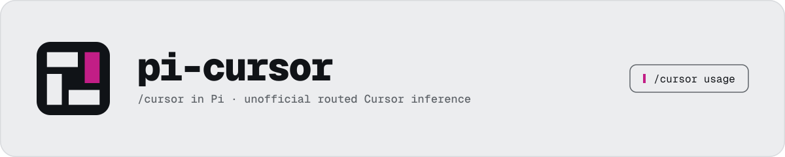

# pi-cursor-inference

<picture>
  <source media="(prefers-color-scheme: dark)" srcset="docs/banner-dark.svg">
  
</picture>

This package implements Cursor as an unofficial plain inference provider for
[Pi](https://github.com/earendil-works/pi-mono) over
`aiserver.v1.InferenceService/RunInference`. Cursor supplies inference while Pi owns the complete
conversation, arbitrary tool schemas, tool execution, branching, and transcript.

## Install

```sh
pi install npm:pi-cursor-inference
```

Then authenticate and select a Cursor model:

```text
/login cursor
/model
```

To evaluate the extension without adding it to settings:

```sh
pi -e npm:pi-cursor-inference
```

Pi packages execute with full local access. Review this repository before installation. The
[pre-publication privacy audit](https://github.com/victor-software-house/pi-cursor/blob/main/docs/public-history-audit-2026-09-03.md)
records the complete history review performed before the repository became public.

## Features

- Native Pi OAuth through `/login cursor`, plus `PI_CURSOR_TOKEN` for headless use.
- Dynamic model discovery from `AvailableModels`, `GetUsableModels`, and
  `GetDefaultModelForCli`.
- Catalog-backed context windows, image/thinking capabilities, and distinct Max Mode rows only
  when Cursor advertises a meaningful variant difference.
- Streaming thinking text when the provider supplies it, opaque reasoning signatures, text,
  usage, generic tool-call argument deltas, and tool continuations.
- Final response assembly always preserves routed thinking text when Cursor's final message carries
  only redacted or signature-only reasoning metadata.
- Strict reconciliation defaults on: completed streamed and final tools must match by ID, name, and
  deep-equal arguments before Pi can execute them. It can be disabled explicitly in settings.
- Multi-block reasoning metadata matches only by exact signature or exact text, with an unambiguous
  one-to-one fallback; unmatched metadata stays separate instead of attaching by array index.
- Bare `/cursor` opens an action selector for the usage and settings panes.

## Cursor command

Run `/cursor` in TUI mode to choose between **Usage** and **Settings**. Direct commands remain
available:

- `/cursor usage` — account usage with Summary and Models views;
- `/cursor settings` — strict reconciliation and persisted diagnostics;
- `/cursor help` — command shape.

Outside TUI mode, bare `/cursor` and `/cursor help` print the command shape because no selector can
be hosted.

## Usage pane

Run `/cursor usage` to open the account usage pane. It shows the current plan and reset date,
included and on-demand usage for ordinary plans, or current/previous cumulative spend for
Enterprise plans. When the backend returns a per-model breakdown, **Tab** switches between
**Summary** and **Models**; `r` refreshes and `q`/Esc closes the pane.

The pane uses captured DashboardService calls and renderer-defined units. It does not infer prices
from model tokens or substitute values for missing samples. Optional failed calls remain visible as
named misses while available usage still renders. Outside TUI mode, print writes plain text, JSON
emits a custom message event, and RPC uses a notification.

## Turn usage and billed cost

When RunInference supplies a usage arm, the completed Cursor assistant response stores those token
counts in Pi's standard message usage fields. `extendedUsage` supplies input, output, cache-read,
and cache-write counts and takes precedence. Basic `usage` supplies only prompt and completion
counts, so the cache fields remain zero. A successful response with no usage arm retains the
initialized zero values; those zeros are not provider-reported token measurements.

The typed RunInference response contract has no money field. Its `providerMetadata` arm is an untyped
object, but the formatted client does not read a billed-cost key from it. Cursor models therefore use
zero price rates in Pi, and Pi's per-turn `cost` remains zero rather than applying a rate table that
can differ from the account's billed result.

Fine-grained billed-cost records exist, but not in the RunInference response:

- The pinned Cursor client schema includes DashboardService `GetFilteredUsageEvents`. Its event rows
  carry model, Max Mode, token counts, model cost (`tokenUsage.totalCents`), Cursor Token fee,
  `chargedCents`, timestamp, client type, and optional `conversationId`. The current `/cursor usage`
  pane calls only aggregate DashboardService methods; account/role access to the filtered endpoint
  has not been live-verified for this package.
- The same DashboardService schema includes `GetClientUsageData`, whose request takes
  `conversationId` and an int32 `timestampBeforeRequest`, and whose response contains named
  `costInCents` items. Exact-symbol searches find no caller or field consumer in the full packaged
  Cursor 3.18.9 workbench or agent-host JavaScript, so the source does not establish the timestamp
  unit, item meanings, settlement timing, or concurrent-request behavior.
- `AiService.CheckUsageBasedPrice` returns cents and a price ID for proposed feature details. The
  formatted workbench uses it only to render a usage-based-pricing preflight before enablement; it
  has no conversation or invocation identifier and is not measured post-response usage.
- The official [Admin API usage-events endpoint](https://cursor.com/docs/account/teams/admin-api#get-usage-events-data)
  exposes a closely matching event shape through separate Team Admin API-key authentication. Its
  documented data is aggregated hourly.
- Cursor's [Agent SDK](https://cursor.com/docs/sdk/python) exposes eventual billed cost by local turn
  or cloud run through `agent.get_usage()`. That interface belongs to Cursor's agent runtime, which
  this package does not use because Pi owns the agent loop, tools, execution, and transcript.

Neither DashboardService monetary shape nor the Admin API usage-event shape exposes RunInference's
per-call `invocationId`. `pi-cursor` sends the stable Pi session ID as Cursor's `conversationId`, so
several inference calls share that identifier. A model/timestamp/token match may identify an event in
ordinary data, and `GetClientUsageData` offers a conversation/time boundary, but neither contract
provides an identifier-level join to one RunInference call. Their attribution and settlement
semantics are not established under concurrent requests. `pi-cursor` therefore does not assign
those cents to individual Pi messages. See the
[formatted-source audit](https://github.com/victor-software-house/pi-cursor/blob/main/docs/protocol/turn-accounting-source-audit-2026-09-04.md)
for the exact pinned modules, full-bundle searches, and fields.

## Configuration

`/cursor settings` persists two toggles in Pi's agent directory:

- **Strict reconciliation** defaults to **on**. When enabled, streamed and final response copies
  must be structurally equal; tool IDs, names, and arguments are checked before local execution. When
  disabled, Cursor's final content is accepted without that cross-copy equality check. Local stream
  validity, advertised-tool validation, and final-content parsing remain mandatory.
- **Persist diagnostics** defaults to **off**. When enabled, each assistant message carries a
  `cursor-inference-response` diagnostic in session JSONL. Its reconciliation census is payload-free;
  the same diagnostic can also retain provider metadata, image descriptions, and inference-extra
  side-channel data. The current structural census is about 0.6 kB per assistant message (roughly
  56 kB per 100 turns); provider side channels can make it larger. When disabled, Cursor adds no
  assistant-message diagnostic data.

The thinking-loss fix is not configurable. Empty, signature-only, or redacted final reasoning can
never erase non-empty streamed thinking, even when strict reconciliation is off.

Cursor Max Mode defaults to **off**, matching the IDE's ordinary composer model configuration.
Catalog entries with a distinct Max Mode appear as separate `-max` models and carry Cursor's
captured context parameter automatically. Advanced callers may override the Cursor-specific
`cursorMaxMode` and `cursorContext` sampling parameters per request.

## Verification

`mise run verify` is the deterministic gate. It runs formatting/lint checks, TypeScript checking,
105 unit tests, the minified build, publint, the package whitelist, Node and Bun imports of the
extracted tarball, and Pi's real extension loader. The loader proof requires the packed artifact to
register `/cursor` and exactly one native `cursor` provider. Packed CLI checks also require
`/cursor help` to emit plain text in print mode and a custom message event in JSON mode.

A fresh-account live proof on 2026-09-03 established:

- all three catalog surfaces decode and produce selectable models;
- DashboardService usage loads without exposing account values in test output;
- Composer 2.5 returns text through the production RunInference transport;
- the isolated Pi TUI renders both Summary and Models, switches with Tab, closes with `q`, and
  displays optional aggregate timeouts as named partial misses.
- every live inference result explicitly enables and validates the payload-free
  text/reasoning/tool reconciliation census inside its diagnostic;
- a paid arbitrary-tool turn proved streamed/final tool equality and continued with the local result.

The implementation is pinned to Cursor IDE 3.18.9 for managed inference and
`cursor-agent 2026.09.02-fa0c06e` for catalog/usage evidence. Darwin host identity is verified
against Cursor's algorithm. Linux and Windows identity branches have deterministic fixtures but
have not been host-verified. Packet-level HTTP/2 framing and future Cursor server compatibility are
not claimed.

## Scope boundary

- No `AgentService/Run`, Cursor-native tools, MCP projection, or agent bridge.
- No multi-account database, keychain/1Password reader, or installed-IDE dependency.
- No synthesized Grok thinking summary: current RunInference measurements provide an opaque
  continuation signature but no reasoning text for Grok 4.6.

See the
[implementation and verification record](https://github.com/victor-software-house/pi-cursor/blob/main/docs/plan.md)
and [protocol and scope decisions](https://github.com/victor-software-house/pi-cursor/blob/main/docs/decisions.md).
